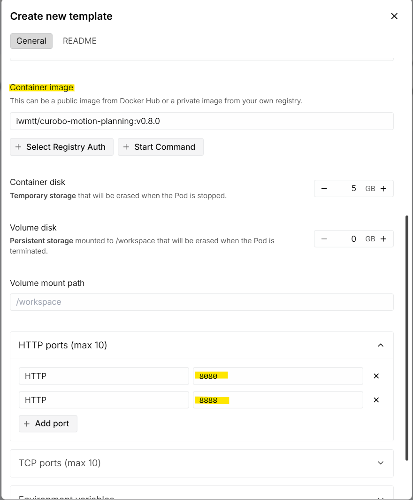
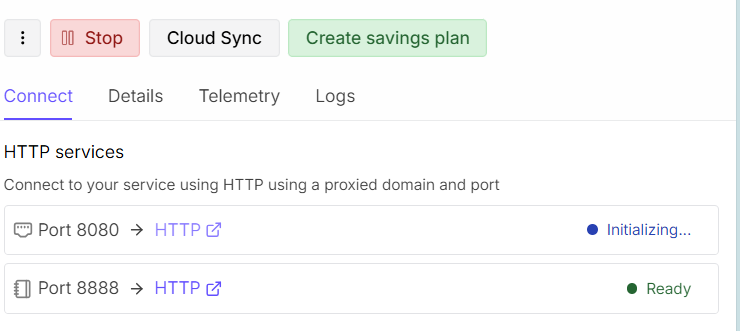
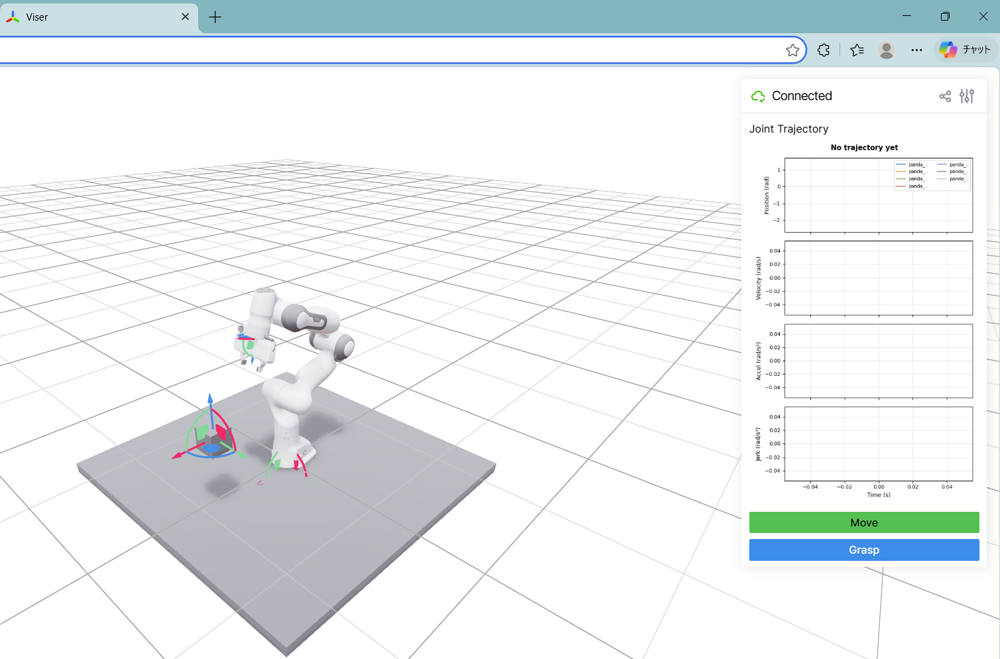

# cuRobo Motion Planning + Jupyter Docker Image

cuRobo の公式ドキュメントにあるモーションプランニングのインタラクティブ例+jupyterを、Runpod で使うためにまとめたDocker構成。

コンテナ起動後に次の 2 つへアクセス可能。

- `http://<host>:8080`: cuRobo の https://nvlabs.github.io/curobo/latest/getting-started/motion_planning.html の例
- `http://<host>:8888`: Jupyter Notebook

## 1. 前提条件

- NVIDIA GPUとDocker が利用可能な環境
- Runpod 等で使う場合は、HTTP ポート `8080` と `8888` の公開が必要

## 2. ビルド

clone後、リポジトリ直下で下記を実行:

```bash
docker build -t curobo-motion-planning:test .
```


（Hubから消えてなければ）下記からビルド済みのイメージを取得可能。
```bash
docker push iwmtt/curobo-motion-planning:v0.8.0
```

## 3. 実行

Linux/macOS の例:

```bash
docker run --rm -it --gpus all -p 8888:8888 -p 8080:8080 curobo-motion-planning:test
```
起動後、ブラウザで以下へアクセス:

```text
http://localhost:8080
http://localhost:8888
```

`8080` 側では、 https://nvlabs.github.io/curobo/latest/getting-started/motion_planning.html　のインタラクティブ例を実行:


`8888` 側では Jupyter Notebook を開いて、`/workspace` 配下でノートブックの作成・実行が可能。

## 5. Runpodでの利用

My Templates > New templateでテンプレートを新規作成、Container imageおよびHTTP ports欄を指定し、Save Templateを実行。
Container image欄は、ご自身でdockerhubにpushしたものか、(消えてなければ)`iwmtt/curobo-motion-planning:v0.8.0`を指定。



保存したテンプレートを基に、適当にPodを作成・デプロイ完了後、それぞれのポートにアクセスすることで、ブラウザからモーションプランニングのデモ・Jupyter環境にアクセス可能。



